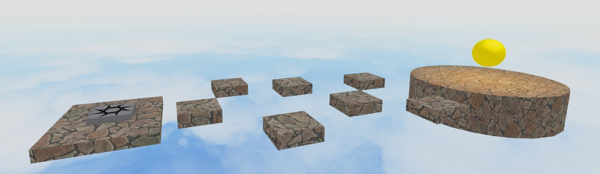

## Parti e piattaforme

**Le parti** sono gli elementi costitutivi del tuo gioco. Puoi usarli per creare ambienti e modelli per il tuo gioco.

### Aggiunta di parti

Nella scheda **Home** , fare clic su **Parte**.

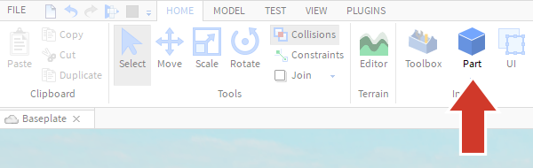

Una parte apparirà al centro esatto della vista della videocamera. Se desideri un maggiore controllo sul punto in cui appare la parte, ingrandisci la videocamera e centrala nel punto in cui desideri che appaia la parte.

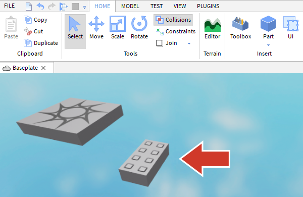

{}
**Utilizzo di parti diverse**  
È possibile aggiungere diverse forme di parti. Per aggiungere una parte diversa, fare clic sulla piccola freccia sotto Parte e selezionare un nuovo tipo dal menu a discesa.  
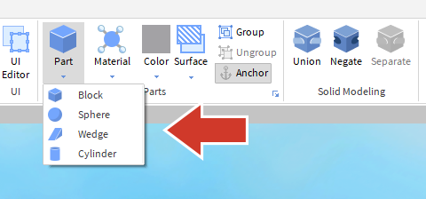
{}

### Spostare le parti

1. Fare clic sulla parte.
1. Utilizzare i controlli della fotocamera o premere Fper ottenere una visualizzazione migliore.
1. Fare clic sullo strumento Sposta .
1. Trascina le frecce per spostare la parte.

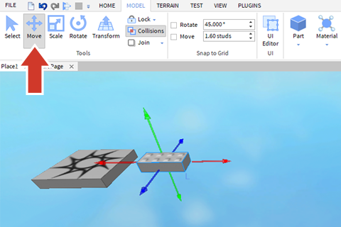

### Collisioni e snapping

Collisioni e snap sono due impostazioni che puoi utilizzare per ottenere un maggiore controllo durante lo spostamento delle parti.

Mentre sposti le parti, potresti notare un contorno bianco ogni volta che una parte tocca un'altra parte. Ciò indica che è in corso una collisione. In Roblox Studio, la funzione **Collisioni** ti consente di controllare se le parti possono spostarsi l'una nell'altra.

* **Collisioni attivate** : non sarà possibile spostare una parte in un punto in cui si sovrappone a un'altra parte.
* **Collisioni disattivate** : puoi spostare liberamente le parti tutt'intorno.

#### Disattiva le collisioni

Se le collisioni sono attive, il pulsante sarà evidenziato in grigio. Fare clic sul pulsante Collisioni per disattivarlo.

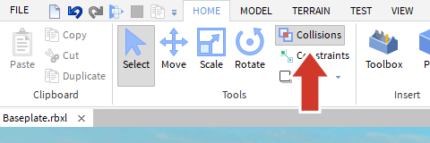

#### Modifica dello snap delle parti

Lo snap è la quantità che una parte si sposterà, ridimensionerà o ruoterà alla volta. Se noti che una parte sposta più borchie (l'unità di misura Roblox) alla volta, ciò è dovuto allo scatto. Lo snap è utile quando si creano oggetti che devono essere posizionati esattamente, come il modo in cui i muri degli edifici devono essere posizionati ad angoli di novanta gradi.

#### Disattiva Snap

Per facilitare lo spostamento delle parti, si consiglia di disattivare lo snap per impostazione predefinita.

Disattiva lo snap **deselezionando** la casella accanto a **Ruota** o **Sposta** .

{}
**Modifica dell'importo dello snap**  
Se desideri lo snap, puoi modificare le impostazioni nella scheda Modello . Basta inserire numeri diversi per Ruota o Sposta (o fare clic sulle piccole frecce all'interno dei campi). Durante lo spostamento, le parti vengono spostate in perni, l'unità di misura di base in Roblox.  
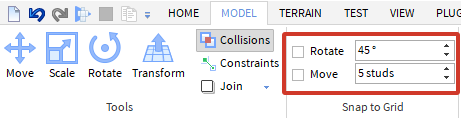
{}

### Creazione del salto del primo giocatore

Un obby di solito inizia con un semplice puzzle di salto. In qualità di bravo progettista di giochi, vuoi che sia facile per i nuovi giocatori iniziare. Se lo rendi troppo difficile subito, i giocatori potrebbero semplicemente smettere invece di continuare a giocare.

1. Allontana leggermente la parte da SpawnLocation per creare un salto facile.
1. **Non provare** ancora il tuo gioco.

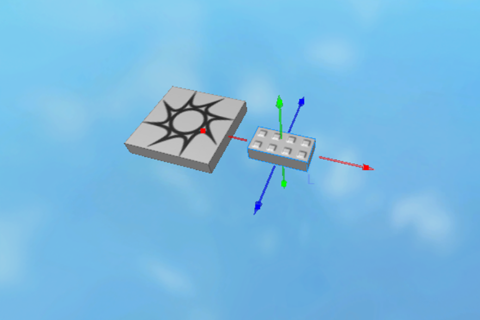

### Ancorare le parti

Se a questo punto provi il gioco, noterai che tutte le parti che hai aggiunto (oltre a SpawnLocation) cadranno. **L'ancoraggio** impedisce alle parti di cadere. Rimarranno anche sul posto quando i giocatori e altri oggetti li incontreranno.

Per ancorare le parti:

1. Seleziona la parte che desideri ancorare.
1. Vai alla finestra **Proprietà** .
1. Scorri verso il basso fino a **Comportamento**.
1. Controlla **Ancorato**.
1. Salva e prova il tuo gioco.

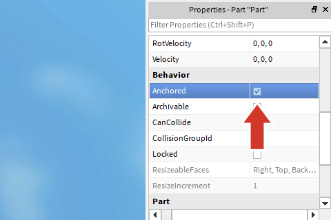

### Ridimensionare e ruotare le parti

Un intero livello della stessa parte dall'aspetto non sarebbe così eccitante per i giocatori. Ridimensionando e ruotando le parti, puoi creare parti diverse che aggiungeranno varietà al tuo obby.

Per scalare la tua parte:

1. Nella scheda **Home**, fai clic sul pulsante **Scala** .
1. Trascina le sfere per modificare le dimensioni del blocco.

Per ruotare una parte:

1. Fare clic sul pulsante **Ruota** .
1. Trascina le sfere per modificare le dimensioni del blocco.

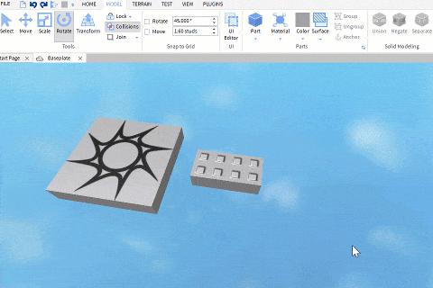

{}
Suggerimenti per lo spostamento di parti  
- Se la parte viene ridimensionata o ruotata gradualmente, potrebbe essere necessario regolare o disattivare lo snap.  
- Se alla parte viene bloccato il movimento o la rotazione in un'altra parte, disattivare le collisioni potrebbe semplificare le cose.
{}

#### Aggiungi un altro salto

Questo è l'inizio del tuo gioco, quindi non vuoi che i salti siano molto difficili. Vuoi che il giocatore pensi che il tuo gioco sia divertente e continui a giocare. Mentre costruisci, sperimenta la rotazione e il ridimensionamento.

Aggiungi altre due parti al tuo gioco.
Salva e prova.

{}
Ricordati di ancorare la parte con **Anchor**
{}

Se una qualsiasi delle tue parti cade, assicurati di ancorarla .

### Finire il tuo primo livello

#### Crea un'area di partenza

L'area di partenza è la prima cosa che un giocatore vede quando atterra nel tuo gioco. Sono un luogo in cui presentare nuovi giocatori al tuo mondo e iniziare a impostare il tema per il tuo gioco. Pensa agli ultimi giochi che hai giocato. Com'era l'area di partenza? Cosa ti hanno fatto pensare al gioco?

Le aree di partenza possono essere semplici come una parte importante per creare un pavimento o fantasiose come desideri.

Se la parte viene ridimensionata o ruotata gradualmente, potrebbe essere necessario regolare o disattivare lo snap .
Se alla parte viene bloccato il movimento o la rotazione in un'altra parte, disattivare le collisioni potrebbe semplificare le cose.

#### Progetta il resto del livello

Dedica dai cinque ai dieci minuti per completare la prima sezione dell'obby. Il tuo gioco dovrebbe avere:

4-5 parti di diverse dimensioni e forma.
È stato testato per verificare che un giocatore possa arrivare alla fine senza troppe frustrazioni.

#### Crea una End Zone

Alla fine del tuo primo puzzle di salto, crea un'area di atterraggio più grande per far fare una pausa ai tuoi giocatori. Questo fungerà da fine livello e darà ai giocatori un posto dove riposare.

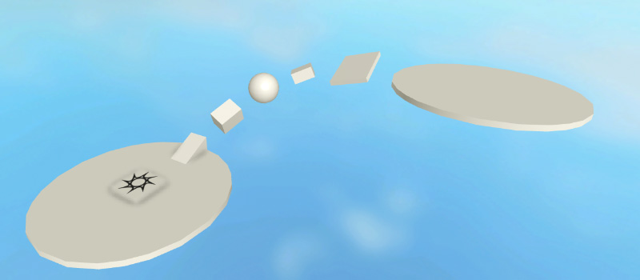

### File di progetto finito

Scarica un progetto finito [qui](./DesigningAnObby_FinishingYourLevel_End.rbxl).