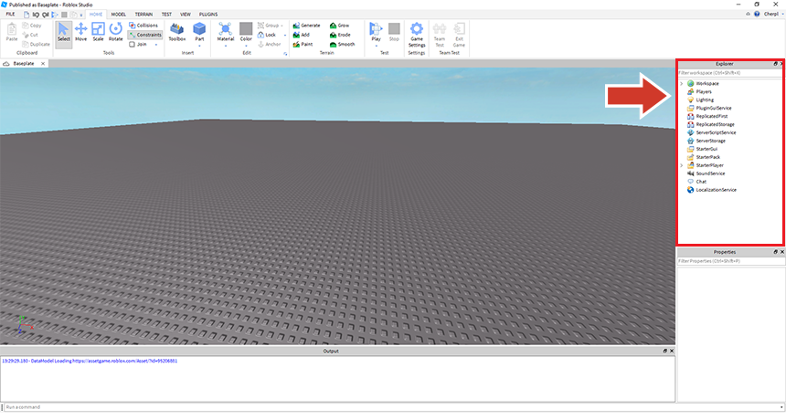
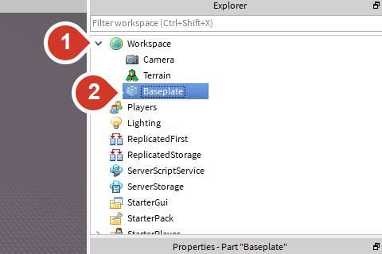
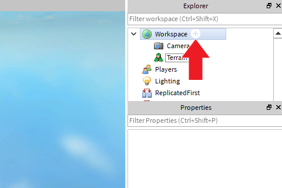
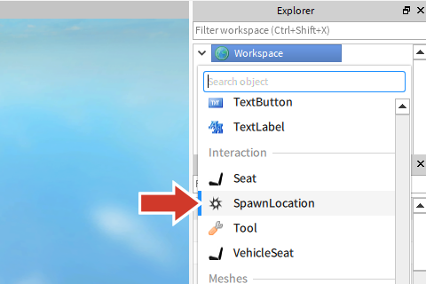
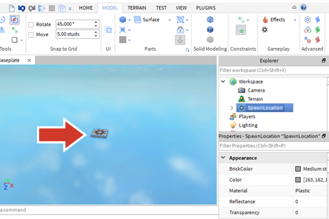
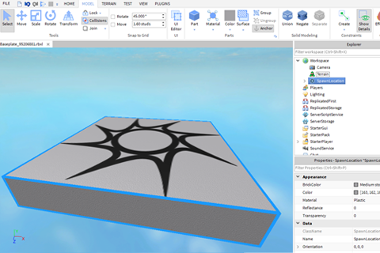
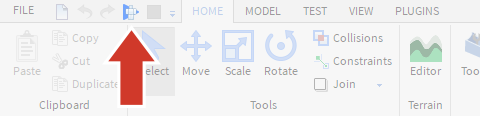
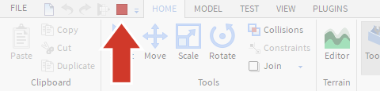

## Nozioni di base di Roblox Studio

Se inizi a costruire il tuo obby sopra la piastra di base grigia, il tuo giocatore cadrà in modo innocuo sulla piastra di base invece di morire quando perde il salto. Questo non dà esattamente al tuo giocatore la sfida che vuoi che abbia. Per rimuovere la piastra di base, dovrai utilizzare la finestra di **Explorer**.

La finestra Explorer si trova in genere a destra dell'area di lavoro ed elenca tutti gli oggetti all'interno del gioco. Puoi utilizzare Explorer per selezionare e lavorare con le parti del gioco, anche se non riesci a trovarle nella vista 3D.

## Eliminazione della piastra di base

Per eliminare la piastra di base:

1. Fare clic sulla freccia accanto a Area di **lavoro** nella finestra Esplora.
1. Seleziona **Piastra di base**.
1. Premi `Delete` sulla tastiera.

## Creazione di un inizio giocatore

La prima cosa da fare quando si crea un gioco è determinare da dove iniziano i giocatori. Lo **SpawnLocation** è dove un giocatore appare nel mondo all'inizio del gioco o dopo essere caduto una piattaforma. Senza SpawnLocation, il giocatore potrebbe apparire da qualche parte in modo casuale e cadere verso il suo destino.

### Crea un SpawnLocation

1. Nella finestra Explorer, passa con il mouse su Area di lavoro e fai clic sul pulsante circolare + .

1. Scorri l'elenco a discesa fino a trovare **SpawnLocation** e fai clic su di esso.

1. SpawnLocation verrà creato al centro esatto della vista della videocamera.

### Concentrati su SpawnLocation

Se le parti sono troppo lontane dalla fotocamera, può essere difficile lavorarci. Usa i controlli della fotocamera ei tasti di scelta rapida per ottenere una migliore visualizzazione delle parti con cui stai lavorando.

Per mettere a fuoco la telecamera su SpawnLocation:

1. Seleziona SpawnLocation in Explorer.
1. Premere `F` per mettere a fuoco la telecamera sulla parte selezionata.

## Spostare la fotocamera

Ora che hai un oggetto nel tuo gioco, fai clic nella vista 3D e sposta la telecamera per ottenere una visione migliore.

### Controlli della fotocamera

{}
La fotocamera non si muove?  
Per spostare la visuale, fai clic all'interno della finestra del gioco, quindi prova a premere nuovamente uno dei tasti di movimento.
{}

## Metti alla prova il tuo gioco

Il **playtest** è il processo con cui tu o un tuo pari stai giocando per assicurarti che tutto funzioni e capire come renderlo ancora migliore. È una buona idea provare il gioco ogni volta che apporti modifiche.

Quando esegui il test:

* Assicurati che il tuo gioco funzioni, in particolare le modifiche che hai appena apportato.
* Cerca aree che possono essere migliorate.

### Prova il tuo gioco

1. Salva il tuo gioco. Ricordati di cambiare il nome del file.
1. Fare clic sul pulsante **Riproduci** .

### Controlli della fotocamera nel gioco
I controlli della fotocamera nel gioco sono simili a quando ti trovi nell'editor.

### Interrompi il test di riproduzione

Per interrompere il playtest, fai clic sul quadrato rosso.

{}
Non apportare modifiche in modalità test  
Le modifiche apportate in modalità di riproduzione non verranno salvate. Dovrai rifarli di nuovo quando tornerai alla modifica.
{}
