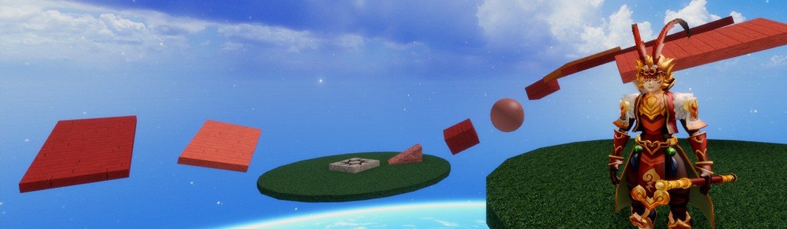
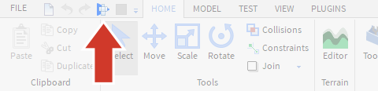
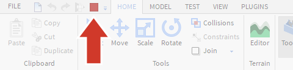

## Introduzione al progetto e configurazione dei file

In un obby, abbreviazione di percorso a ostacoli, i giocatori saltano da un oggetto all'altro evitando gli ostacoli per arrivare alla fine di un livello.

Prima di progettare il tuo, c'è un modello di esempio che puoi provare. I modelli sono progetti predefiniti che puoi utilizzare come inizio per i tuoi giochi.

### Apri il modello

1. Apri Roblox Studio .
1. Nell'angolo in alto a sinistra, fai clic su Nuovo .
1. Scorri fino a visualizzare il modello denominato Obby .
1. Fare clic sul modello per aprirlo.

### Chiudi le finestre inutili

1. Quando apri per la prima volta Studio, saranno aperte alcune finestre che non ti servono. Chiudili in modo da avere più spazio per lavorare sul tuo gioco.

1. Chiudi la finestra Tutorial.

1. Il tuo spazio di lavoro dovrebbe ora assomigliare a questo:

{}
Se desideri riaprire una finestra che hai chiuso, vai nella scheda Visualizza e fai clic sul nome della finestra che desideri aprire.
{}
1. Prova il modello Obby
Fai clic sul pulsante **Play** nell'angolo in alto a sinistra.

1. Interrompi il test di riproduzione
Per interrompere la prova, premi il pulsante rosso Stop.

### Creazione di un nuovo progetto
Ora che sai cos'è un obby, puoi crearne uno tuo.
1. Per chiudere obby, nell'angolo in alto a sinistra, fare clic su File> Chiudi. Se viene richiesto di salvare, fare clic su No.
1. Torna alla sezione Nuovo, fai clic sul modello **Baseplate**.

### Salvataggio di progetti

Ogni volta che stai lavorando a un gioco, salva ogni 10 minuti . In questo modo, se qualcosa va storto, almeno non hai perso molto lavoro. Una volta pubblicato, puoi modificarlo da qualsiasi computer.

1. Seleziona File → Pubblica su Roblox per aprire la finestra di pubblicazione.

1. Immetti un nome e una descrizione facoltativa.

1. Quando sei pronto, fai clic sul pulsante **Crea ...**

{}
Studio salverà un backup temporaneo del tuo lavoro ogni tanto. Se per qualche motivo non riesci a trovare il tuo file, vai a:

1. File> Avanzate> Recenti
1. Apri il file e salvalo di nuovo in un posto dove potrai trovarlo.
{}